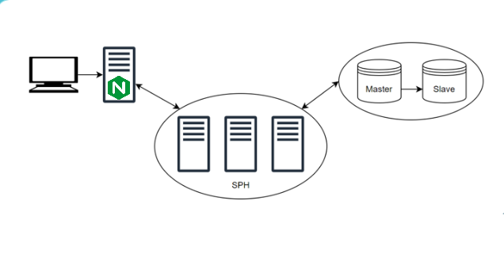

# 5HASH

## Structure du projet 

Ce projet est disponible dans 2 environments pour déployer l'infrastructure.

*   **rce** : Environnement de pré-production.
*   **prod** : Environnement de production.

### Modules 

Dans le dossier `modules/` on retrouve trois composants réutilisables pour définir l'infrastructure :

**mysql**

*   `main.tf` : Contient la configuration des ressources MySQL.
*   `provider.tf` : Contient le provider utilisé.
*   `variables.tf` : Contient les variables nécessaires au module. 

**nginx**

*   `main.tf` : Contient la configuration des ressources NGNIX.
*   `provider.tf` : Contient le provider utilisé.
*   `variables.tf` : Contient les variables nécessaires au module. 
*   `nginx.conf.tpl` : Contient un modèle de configuration pour NGNIX. 

**prestashop**

*   `main.tf` : Contient la configuration des ressources PrestaShop.
*   `provider.tf` : Contient le provider utilisé.
*   `variables.tf` : Contient les variables nécessaires au module. 


#### Architecture

Voici un schéma représentant l'architecture utilisé pour réaliser ce projet.



*   Le client est obligé de passer par le proxy Nginx afins d'interroger un service prestashop

*   Quand a lui, le proxy répartis les charges à travers le nombre de service prestashop qui est répliqué.
*   Le service prestashop quand a lui s'occupe d'aller interroger la bdd
*   Ka relation Master-Slave de la bdd permet d'éviter une perte de données si le Master tombe (le slave reprend la main).


## Démarrage

### Prérequis

*   Terraform doit être installé sur la machine.
*   Docker doit être installé sur la machine.


### Mots de Passes

Avant de pouvoir déployer l'infrastructure, il faut mettre en place les variables d'environnements suivantes : 

```Bash
export TF_VAR_db_user=somesecret
export TF_VAR_db_passwd=somesecret
```

#### Commandes Terraform 

1. **Initialisez le projet**
```Bash
terraform init
```
3. **Déploiement de l'infrastructure**
```Bash
terraform deploy
```
4. **Détruire l'infrastructure**
```Bash
terraform destroy
```
